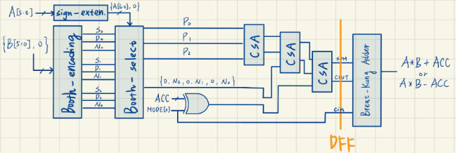
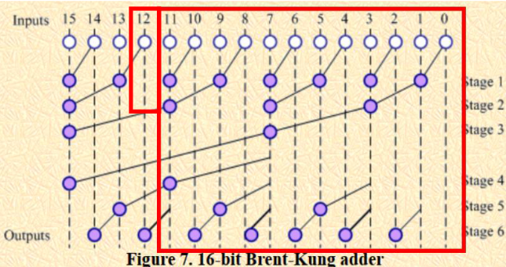
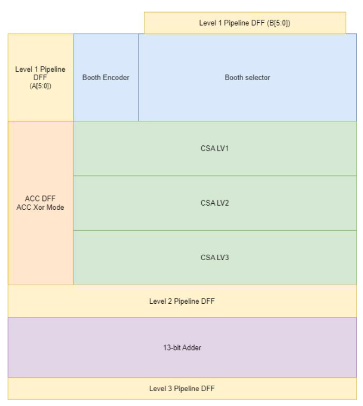
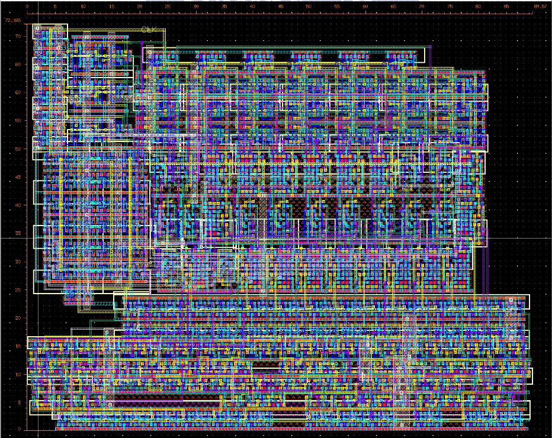

# 6-bit MAC with 3-stage Pipeline Design => [Report](109611070_report.pdf)

## Overall Structure: Booth Multiplier + 3-stage CSA + Parallel Prefix Adder 

## Parallel Prefix Adder Selection: Brent-Kung Adder

## Layout Plan

## Final Layout Result
