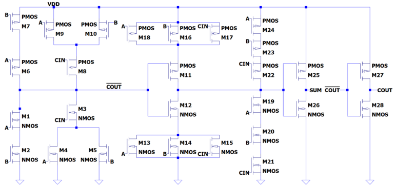
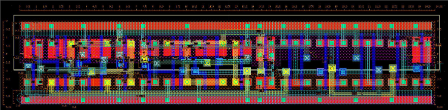
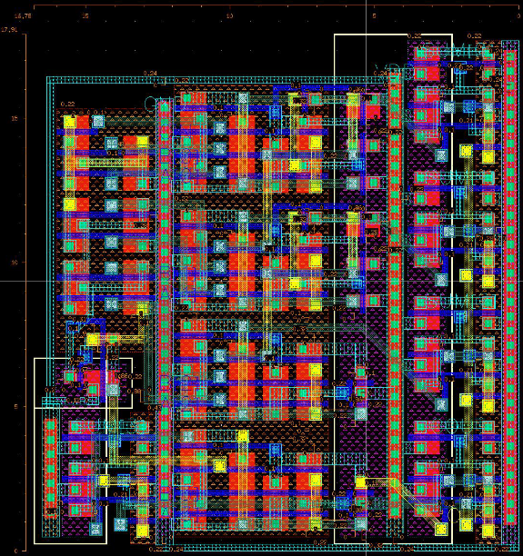
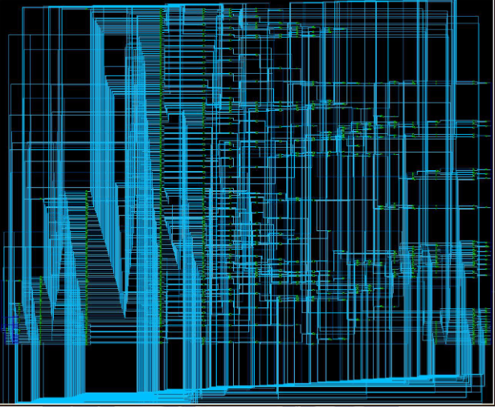
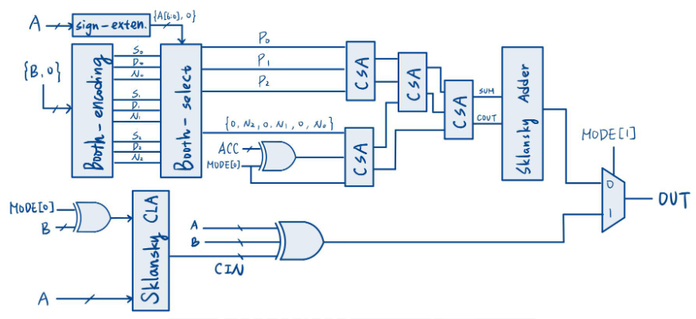
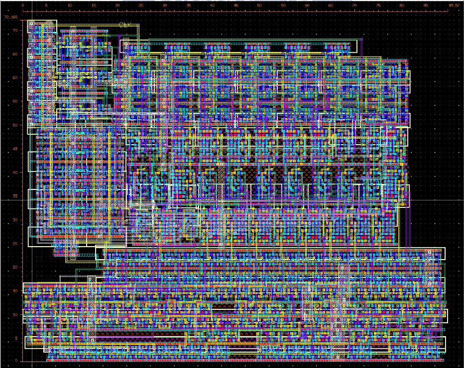

# **NYCU 2022 Fall - VLSI Lab**
*  **Lab1:** 1-bit CMOS FA Hspice Pre-sim
  

*  **Lab2:** 1-bit FA with stdcell layout
  

*  **Lab3:** 4-bit FA with DFF
  

*  **Lab4:** Logic Synthesis on adder/multiplier
  

*  **Lab5:** 6-bit MAC using Booth encoding & Parallel Prefix adder 
  

*  **Final:** 6-bit MAC with 3-stage pipeline
  

